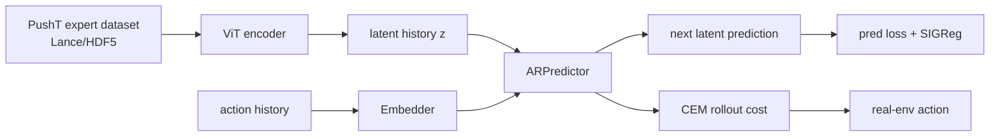
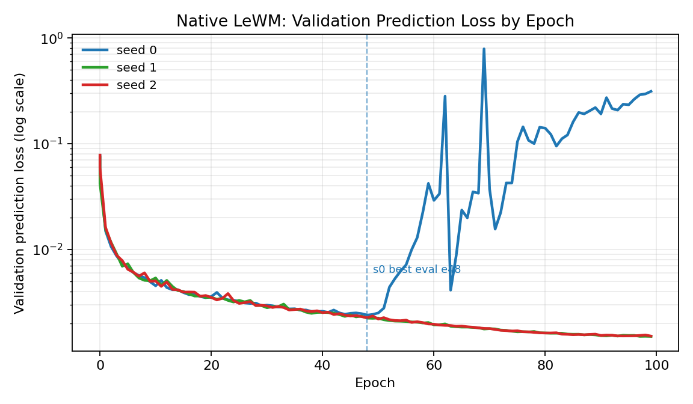
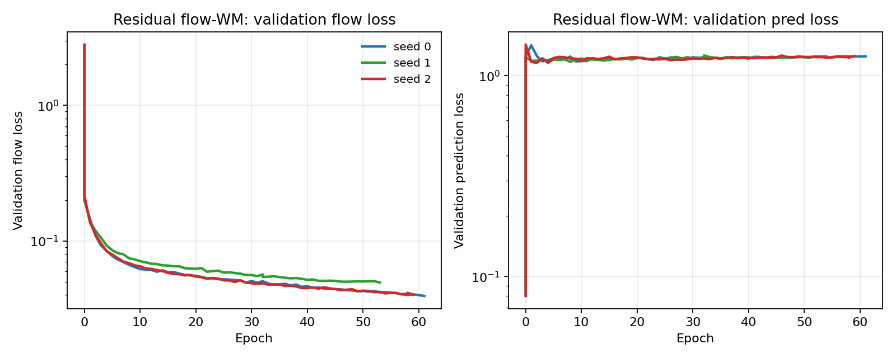
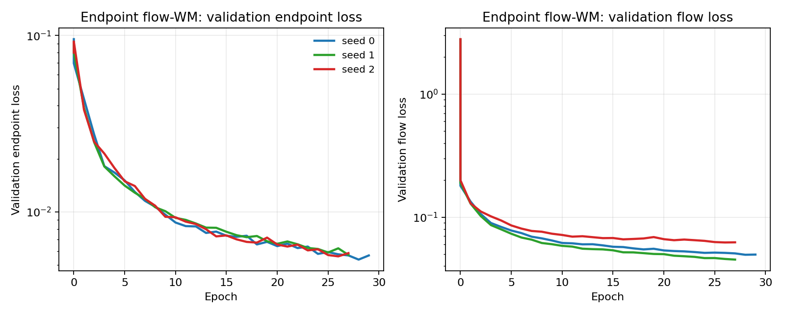
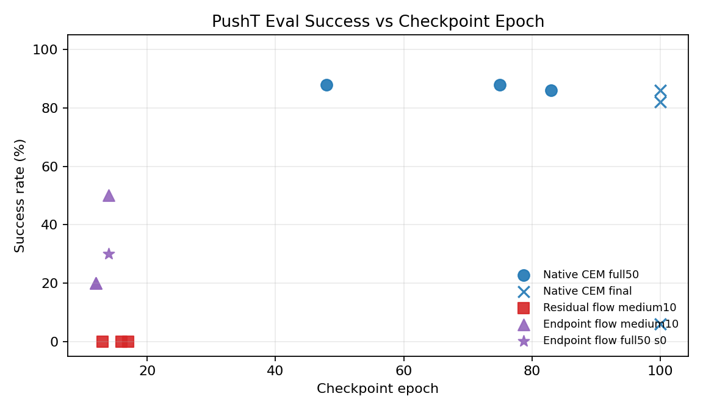

# LeWM Flow-WM Progress Report

Generated: 2026-06-11 EDT

Scope: PushT experiments in the LeWM codebase. This report emphasizes completed or interpretable comparisons and marks incomplete/diagnostic results explicitly. Debug runs, broken submissions, and Slurm repair details are excluded unless they affect interpretation.

Sources:

- Local outputs: `/storage/project/r-agarg35-0/eliu354/external_data/lewm_stablewm/experiments/`
- W&B project: `lewm-flow-2x2`
- Status log: `docs/flow_2x2_status.md`
- Design notes: `docs/flow_wm_residual_cfm_plan.md`, `docs/flow_wm_followups_20260609.md`

## Conclusion & Insights

The current evidence does **not** support replacing LeWM's native deterministic world model with the flow-WM variants we tried. The useful result is diagnostic: the experiments identify where a naive flow dynamics objective breaks the LeWM planning pipeline, and they suggest that future flow-WM work should be planner-aligned rather than only better at one-step flow matching.

Main takeaways:

1. **Native LeWM + CEM is still the reference to beat.**
   With selected checkpoints, native LeWM reaches `87.3 +/- 1.2%` full50 success across seeds (`88/86/88`). This is the strongest completed PushT result.

2. **Checkpoint selection matters enough to change conclusions.**
   Native seed 0 collapses from `88%` full50 at epoch 48 to `6%` at epoch 100. Its validation prediction loss also degrades from `0.00239` to `0.31281`. Reporting only final epoch would make the native baseline look much weaker than it is.

3. **The first residual flow-WM optimizes the wrong signal for CEM.**
   Residual flow-WM reduces flow loss, but deterministic rollout prediction loss stays around `1.2`, cost ranking is near random, and medium10 real-env success is `0/30`.

4. **Endpoint flow-WM validates the diagnosis but is not sufficient.**
   Adding endpoint prediction loss repairs deterministic one-step prediction by about two orders of magnitude relative to residual flow-WM, and improves medium10 to `30%` in the first selected screen. However, it remains far below native LeWM and later lower prediction loss does not monotonically improve real-env success.

5. **The next bottleneck is planner-cost alignment, not just endpoint MSE.**
   Endpoint flow-WM can produce strong offline cost ranking for some seeds, but this still fails to produce native-level closed-loop success. The model must give CEM a reliable multi-step cost surface, not just a good one-step endpoint.

## Key Results

### Completed Full50 Results

Protocol: PushT, 50 real-environment episodes, full CEM unless noted. Mean/std is over the displayed seeds.

| World model | Controller | Checkpoint rule | Epochs s0/s1/s2 | Success s0/s1/s2 (%) | Mean +/- std (%) | Read |
| --- | --- | --- | --- | --- | ---: | --- |
| Native LeWM | CEM | selected checkpoints | 48 / 83 / 75 | 88 / 86 / 88 | `87.3 +/- 1.2` | Best completed baseline. |
| Native LeWM | CEM | final epoch 100 | 100 / 100 / 100 | 6 / 82 / 86 | `58.0 +/- 45.1` | Checkpoint-selection ablation; seed 0 collapses. |
| Native LeWM | action-flow proposal | final epoch 100 only | 100 / 100 / 100 | 6 / 68 / 58 | `44.0 +/- 33.3` | Not a selected-checkpoint policy result; do not use as final action-flow claim. |

Endpoint flow-WM has only one completed full50 so far:

| World model | Controller | Seed | Epoch | Success (%) | Read |
| --- | --- | ---: | ---: | ---: | --- |
| Native LeWM | CEM | 0 | 48 | 88 | Native seed-0 reference. |
| Endpoint flow-WM | CEM | 0 | 14 | 30 | Single-seed full50 check; promising vs residual flow, still far below native. |

### Medium10 World-Model Screen

Protocol: PushT, 10 real-environment episodes, full CEM. This is a checkpoint-screening table, not the final full50 table. It is still useful because the task, controller, and episode count are matched.

| World model | Checkpoints | Success s0/s1/s2 (%) | Mean +/- std (%) | Main interpretation |
| --- | --- | --- | ---: | --- |
| Native LeWM | e35 / e28 / e33 | 100 / 90 / 80 | `90.0 +/- 10.0` | Native partial checkpoints are already strong. |
| Residual flow-WM | e16 / e13 / e17 | 0 / 0 / 0 | `0.0 +/- 0.0` | Flow matching alone fails under deterministic CEM rollout. |
| Endpoint flow-WM, first selected screen | e14 / e12 / e12 | 50 / 20 / 20 | `30.0 +/- 17.3` | Endpoint loss is directionally useful. |
| Endpoint flow-WM, later lower-pred-loss screen | e19 / e17 / e17 | 30 / 20 / 10 | `20.0 +/- 10.0` | Lower validation pred loss does not guarantee better closed-loop success. |

### Planner-Cost Diagnostic

Protocol: 16 starts, 128 random action chunks per start. Lower expert rank and lower random-better fraction are better. This is an offline diagnostic, not a downstream success metric.

| World model | Seed | Epoch | Mean expert rank | Random-better frac | Real-env context |
| --- | ---: | ---: | ---: | ---: | --- |
| Native LeWM | 2 | 75 | `1.00` | `0.0000` | Strong full50, `88%`. |
| Residual flow-WM | 2 | 17 | `56.75` | `0.4302` | Medium10/full-CEM evals fail. |
| Residual flow-WM | 2 | 24 | `65.56` | `0.5015` | Near-random cost surface. |
| Endpoint flow-WM | 0 | 19 | `4.31` | `0.0254` | Medium10 `30%`. |
| Endpoint flow-WM | 1 | 17 | `1.06` | `0.0005` | Medium10 only `20%`. |
| Endpoint flow-WM | 2 | 17 | `11.94` | `0.0845` | Medium10 `10%`. |

Read: cost ranking is a better diagnostic than flow loss for whether CEM sees a sensible cost surface. But even strong cost ranking is not sufficient for closed-loop success, as endpoint seed 1 shows.

## Pipeline (w/ Diff)

### Native LeWM Pipeline

### What We Changed

All formal PushT WM comparisons keep the original LeWM data framing, encoder, action embedder, optimizer/checkpointing, W&B logging, real-env eval, and CEM planner interface. The intended controlled variable is the world-model predictor.

| Variant | Predictor change | Loss change | Planner change | Why it was tested |
| --- | --- | --- | --- | --- |
| Native LeWM | Original deterministic `ARPredictor` | next-latent prediction + SIGReg | none | Reference pipeline. |
| Residual flow-WM | Conditional flow predicts latent residual dynamics | flow matching + SIGReg; logged deterministic pred loss | none | Test whether a flow can model multi-modal latent transitions. |
| Endpoint flow-WM | Residual flow plus deterministic endpoint/velocity target | flow matching + endpoint/pred loss + SIGReg | none | Fix mismatch between flow loss and CEM's deterministic rollout endpoint. |
| Action-flow proposal | Native WM retained; learned action-sequence proposal | action-flow imitation loss | replaces CEM sampler/proposal side | Test policy-side flow separately from WM-side flow. |

Important fairness notes:

- The completed full50 native CEM row is the fair current baseline.
- Residual/endpoint medium10 rows are fair for task/controller/eval budget, but they are screening results rather than final full50 claims.
- Endpoint full50 currently has only seed 0, so it should not be compared against a native 3-seed mean as a final result.
- Action-flow was only evaluated on epoch-100 native WMs; because seed 0 epoch 100 collapsed, this does not yet answer whether action-flow helps at selected native checkpoints.

## Ablations & Insights

### 1. Checkpoint Selection Ablation

Native seed 0 is the clearest example that final epoch is not a reliable model-selection rule.

| Native seed 0 checkpoint | Val pred loss | Eval result |
| --- | ---: | ---: |
| Epoch 48 | `0.00239` | `88%` |
| Epoch 61 | later diagnostic, pred loss already degraded | `50%` over 10-episode diagnostic |
| Epoch 100 | `0.31281` | `6%` |

Insight: validation prediction loss is meaningful for native LeWM, and selected checkpoints are necessary for a fair baseline. This also means flow-WM comparisons should avoid claiming victory/loss based only on a final epoch.

### 2. Matched Early Training Signal

At similar early epochs, the three WM families already separate strongly in deterministic rollout quality.

| Model | Seed/epoch set | Mean val pred loss | Mean val flow loss | Real-env signal |
| --- | --- | ---: | ---: | --- |
| Native LeWM | s0 e11, s1 e9, s2 e9 | `0.00505` | n/a | Later native checkpoints become strong. |
| Residual flow-WM | s0 e10, s1 e9, s2 e9 | `1.19898` | `0.06710` | Quick eval aggregate `0/9`; later medium10 remains `0%`. |
| Endpoint flow-WM | s0 e11, s1 e9, s2 e9 | `0.00926` | `0.06493` | Quick eval aggregate `2/9`; later medium10 improves over residual flow. |

Insight: residual flow-WM's flow loss can look reasonable while deterministic prediction is unusable for LeWM's CEM rollout. Endpoint flow-WM directly targets the endpoint and brings deterministic prediction close to native scale, which explains why it is the only flow-WM direction with real-env signal.

### 3. Endpoint Objective Ablation

Endpoint flow-WM improves the right training metric but still does not solve the control problem.

| Endpoint screen | Checkpoints | Mean val pred/endpoint loss | Medium10 mean |
| --- | --- | ---: | ---: |
| First selected screen | e14 / e12 / e12 | `0.00829` | `30.0%` |
| Later lower-pred-loss screen | e19 / e17 / e17 | `0.00690` | `20.0%` |
| Latest training rows | e31 / e29 / e29 | about `0.0055` | latest2 eval pending |

Insight: better one-step endpoint loss is necessary but not sufficient. The useful next question is whether the lower-loss later checkpoints improve cost ranking and full CEM success; those latest2 jobs are queued.

### 4. Planner-Cost Alignment Ablation

Residual flow-WM fails the planner-cost diagnostic: expert action chunks rank only around the middle of random chunks. Endpoint flow-WM often repairs this ranking, especially seed 1.

However, endpoint seed 1 has near-native cost ranking at epoch 17 (`rank=1.06`) but only `20%` medium10. This suggests the current diagnostic captures local action-chunk ranking but not all closed-loop failure modes. Likely missing pieces include multi-step compounding, rollout stochasticity, and whether the selected cost landscape remains stable under CEM's sampled candidate distribution.

### 5. Policy-Side Flow Ablation

Action-flow proposal is not yet a clean negative result. It was evaluated only with epoch-100 native WMs:

- Native CEM at epoch 100: `58.0 +/- 45.1%`.
- Native action-flow at epoch 100: `44.0 +/- 33.3%`.
- Both are confounded by native seed 0 collapse at epoch 100.

Insight: the current data does not justify replacing CEM with action-flow, but the fair test is action-flow on selected native checkpoints, not collapsed final checkpoints.

### Training Curves

The following figures summarize the training/eval signals discussed above.

## Problems & Next Steps

### Current Problems

1. **Flow loss is not aligned with LeWM's deterministic planner interface.**
   Residual flow-WM learns a flow objective but gives CEM a bad deterministic cost surface.

2. **Endpoint prediction improves training metrics but not enough downstream behavior.**
   Endpoint-flow closes much of the one-step prediction gap, yet real-env success remains far below native LeWM.

3. **Validation pred loss is not a complete model-selection signal for endpoint-flow.**
   Later endpoint checkpoints have lower pred loss but do not show better medium10 success so far.

4. **Action-flow proposal is not fairly evaluated yet.**
   The existing full50 action-flow row is tied to epoch-100 native checkpoints, including a collapsed seed.

5. **Some comparisons are still incomplete.**
   Endpoint full50 has only seed 0. Latest endpoint e30/e28/e28 real-env and cost-rank jobs are still queued.

### Recommended Next Steps

1. **Finish the queued latest2 endpoint checks before changing the architecture again.**
   Pending jobs: medium10 full-CEM on e30/e28/e28 and matching cost-rank diagnostics. These answer whether the latest lower pred loss has any downstream value.

2. **Use a multi-signal checkpoint rule for flow-WM.**
   Select checkpoints by validation endpoint/pred loss, medium10 success, and cost-rank together. Do not select by flow loss alone.

3. **Make the next flow-WM objective planner-aware.**
   The most direct ablation is a cost-ranking or margin loss where expert action chunks must score below random/CEM candidate chunks under the LeWM cost.

4. **Test stochastic or multi-sample flow rollout inside CEM.**
   Endpoint-flow currently compresses a distribution into a deterministic endpoint. If uncertainty matters, CEM may need multi-sample rollout costs rather than a single deterministic sampled path.

5. **Re-run action-flow on selected native checkpoints.**
   This isolates whether policy-side flow helps when the world model is actually strong.

6. **Keep native LeWM as the fairness anchor.**
   Report native selected full50 (`87.3 +/- 1.2%`) as the baseline, and report final epoch only as a checkpoint-selection ablation.

### Active/Pending Runs

| Run family | Status | Why it matters |
| --- | --- | --- |
| Endpoint flow-WM training | running/continuing under supervisors | May produce stronger late checkpoints, but current lower pred loss has not yet translated into success. |
| Residual flow-WM training | running/continuing under supervisors | Useful mainly to confirm the flow-loss mismatch; current evidence is already strongly negative. |
| Endpoint latest2 medium10 eval | queued | Tests e30/e28/e28 real-env behavior. |
| Endpoint latest2 cost-rank diagnostic | queued | Tests whether lower endpoint loss improves planner-cost ranking. |

## Appendix: Output Roots

- Native LeWM: `/storage/project/r-agarg35-0/eliu354/external_data/lewm_stablewm/experiments/pusht_native_formal_20260605`
- Residual flow-WM: `/storage/project/r-agarg35-0/eliu354/external_data/lewm_stablewm/experiments/pusht_flow_wm_formal_20260608`
- Endpoint flow-WM: `/storage/project/r-agarg35-0/eliu354/external_data/lewm_stablewm/experiments/pusht_flow_endpoint_formal_20260609`
- Cost diagnostics: `/storage/project/r-agarg35-0/eliu354/external_data/lewm_stablewm/experiments/pusht_cost_diagnostics_20260609`

## Appendix: Caveats

- Mean/std is over displayed seeds, not many independent reruns.
- PushT is the only task included in this report; OGBench/Cube is intentionally not used for claims here.
- Medium10 is a screening protocol; full50 is the main downstream protocol.
- Training wall time is affected by `embers` preemption/resume and is not used as a main scientific comparison.
