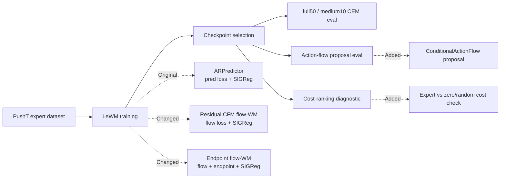

# LeWM Flow Progress Report

Generated: 2026-06-10 EDT

Sources:

- Experiment outputs under `/storage/project/r-agarg35-0/eliu354/external_data/lewm_stablewm/experiments/`
- Planning docs: `docs/flow_2x2_plan.md`, `docs/flow_wm_residual_cfm_plan.md`, `docs/flow_wm_followups_20260609.md`
- W&B project: `lewm-flow-2x2`

Scope: this report summarizes the LeWM experiments in this codebase. Newt is only a formatting reference and is not used as a result source.

## Protocols

| Protocol | Episodes | Planner | Purpose |
| --- | ---: | --- | --- |
| full50 | 50 | CEM unless stated | Main PushT evaluation. |
| medium10 | 10 | CEM | Faster checkpoint comparison. |
| quick3 | 3 | CEM | Debug only; not used for conclusions. |
| cost ranking | 16 starts x 128 random chunks | CEM cost | Checks whether expert actions rank below zero/random actions. |

## Conclusion & Insights

**Main result:** native LeWM + CEM remains the strongest PushT pipeline. Current flow-WM variants are useful diagnostics but not improvements yet.

1. **Native LeWM is strong when using selected checkpoints.**  
   On full50, selected native checkpoints reach `87.3 +/- 1.2%` success across seeds.

2. **Final checkpoint is not a reliable model-selection rule.**  
   Native epoch 100 gives `58.0 +/- 45.1%` because seed 0 collapses to `6%`, while seeds 1/2 remain above `80%`.

3. **Action-flow proposal does not beat CEM.**  
   With the native WM, action-flow full50 is `44.0 +/- 33.3%`, below native CEM.

4. **Residual flow-WM currently fails under CEM.**  
   On matched medium10 evals, residual flow-WM is `0.0 +/- 0.0%`.

5. **Endpoint-aligned flow-WM is the only positive flow-WM signal so far.**  
   Endpoint flow improves medium10 to `30.0 +/- 17.3%` under quick-selected checkpoints, and has one full50 result at `30%`. It is still far below native LeWM.

## Key Results

### Main Full50 Results

All rows below use PushT full50. Scores are success rates in percent.

| Model | Checkpoint rule | Planner / policy | Seed 0 | Seed 1 | Seed 2 | Mean +/- std |
| --- | --- | --- | ---: | ---: | ---: | ---: |
| Native LeWM | selected eval checkpoints | CEM | 88 | 86 | 88 | 87.3 +/- 1.2 |
| Native LeWM | epoch 100 | CEM | 6 | 82 | 86 | 58.0 +/- 45.1 |
| Native LeWM | epoch 100 | action-flow proposal | 6 | 68 | 58 | 44.0 +/- 33.3 |
| Endpoint flow-WM | selected seed 0 checkpoint | CEM | 30 | n/a | n/a | 30.0 |

Interpretation: the best current result is still native LeWM + CEM with checkpoint selection. The seed 0 epoch-100 collapse is why final-checkpoint reporting is misleading.

### Medium10 Flow-WM Comparison

All rows below use PushT medium10 with CEM. Scores are success rates in percent.

| Model | Checkpoint rule | Seed 0 | Seed 1 | Seed 2 | Mean +/- std |
| --- | --- | ---: | ---: | ---: | ---: |
| Residual flow-WM | matched evaluated checkpoints | 0 | 0 | 0 | 0.0 +/- 0.0 |
| Endpoint flow-WM | latest cost-ranking checkpoints | 30 | 20 | 10 | 20.0 +/- 10.0 |
| Endpoint flow-WM | quick-selected checkpoints | 50 | 20 | 20 | 30.0 +/- 17.3 |

Interpretation: endpoint alignment helps, but the best endpoint-flow mean is still far below native full50 performance.

## Training Metrics

Metrics are taken from validation records nearest the evaluated checkpoint epoch. Lower is better for loss columns.

| Model / checkpoint group | Seeds | Eval protocol | Eval success | Val loss | Val pred loss | Val flow loss | Val endpoint loss | Val SIGReg loss |
| --- | ---: | --- | ---: | ---: | ---: | ---: | ---: | ---: |
| Native selected | 3 | full50 | 87.3 +/- 1.2 | 0.1209 +/- 0.0018 | 0.0019 +/- 0.0004 | n/a | n/a | 1.322 +/- 0.024 |
| Native epoch 100 | 3 | full50 | 58.0 +/- 45.1 | 0.2575 +/- 0.2363 | 0.1053 +/- 0.1797 | n/a | n/a | 1.691 +/- 0.628 |
| Residual flow-WM | 3 | medium10 | 0.0 +/- 0.0 | 0.2646 +/- 0.0079 | 1.2075 +/- 0.0099 | 0.0612 +/- 0.0057 | n/a | 2.260 +/- 0.035 |
| Endpoint flow-WM | 3 | medium10 | 20.0 +/- 10.0 | 0.2507 +/- 0.0137 | 0.0069 +/- 0.0002 | 0.0578 +/- 0.0077 | 0.0069 +/- 0.0002 | 2.135 +/- 0.066 |

Training insight:

- Native seed 0 epoch 100 has much worse validation loss than its selected checkpoint, matching the eval collapse.
- Residual flow-WM has low flow loss but very high pred loss and poor eval, so flow loss alone is not a sufficient selection metric.
- Endpoint loss fixes the direct endpoint/pred metric, but eval is still limited, so planner-cost alignment remains the bottleneck.

## Cost-Ranking Diagnostic

Protocol: 16 dataset starts, 128 random action chunks per start. Lower expert rank is better.

| Model | Seed | Epoch | Mean expert rank | Random better frac | Mean expert cost | Mean random cost |
| --- | ---: | ---: | ---: | ---: | ---: | ---: |
| Native LeWM | 2 | 75 | 1.00 | 0.000 | 2.44 | 179.33 |
| Endpoint flow-WM | 1 | 17 | 1.06 | 0.0005 | 4.13 | 29.78 |
| Endpoint flow-WM | 0 | 19 | 4.31 | 0.025 | 4.88 | 30.83 |
| Endpoint flow-WM | 2 | 17 | 11.94 | 0.084 | 14.50 | 41.48 |
| Residual flow-WM | 2 | 17 | 56.75 | 0.430 | 176.00 | 176.22 |
| Residual flow-WM | 2 | 24 | 65.56 | 0.501 | 174.68 | 174.60 |

Diagnostic insight: native LeWM gives CEM a clean ranking surface. Residual flow-WM often cannot distinguish expert from random chunks. Endpoint flow-WM partially repairs this, especially seed 1, but the improvement is not yet consistently reflected in high eval success.

## Pipeline (w/ Diff)

| Pipeline part | Original LeWM | Current experiments |
| --- | --- | --- |
| Data | PushT expert dataset | PushT formal scope; Cube deferred |
| World model | `ARPredictor` | residual flow-WM and endpoint flow-WM |
| Objective | prediction loss + SIGReg | flow loss; endpoint variant adds endpoint loss |
| Planner | CEM/MPC | kept fixed for WM comparison |
| Proposal policy | CEM sampling | optional action-flow proposal |
| Model selection | checkpoint eval needed | cost ranking + medium eval + full50 confirmation |

## Problems & Next Steps

1. **Use selected checkpoints in all main comparisons.**  
   Report final epoch separately as a checkpoint-selection ablation, not as the native baseline.

2. **Regenerate a clean result table after endpoint full50 completes for all seeds.**  
   Current endpoint full50 has only seed 0, so endpoint-vs-native full50 is incomplete.

3. **Use cost ranking as a filter, not the final metric.**  
   Endpoint seed 1 has excellent cost ranking but only moderate eval so far; full50 confirmation is still required.

4. **Do not continue residual flow-WM without a planner-alignment change.**  
   The diagnostic shows its CEM cost surface is not usable.

5. **Next flow-WM ablation should vary endpoint/planner alignment.**  
   Candidate axes: endpoint-loss weight, deterministic vs stochastic rollout, multi-sample CEM rollout, and cost-ranking-selected checkpoints.

## Appendix

Important output roots:

- Native LeWM: `/storage/project/r-agarg35-0/eliu354/external_data/lewm_stablewm/experiments/pusht_native_formal_20260605`
- Residual flow-WM: `/storage/project/r-agarg35-0/eliu354/external_data/lewm_stablewm/experiments/pusht_flow_wm_formal_20260608`
- Endpoint flow-WM: `/storage/project/r-agarg35-0/eliu354/external_data/lewm_stablewm/experiments/pusht_flow_endpoint_formal_20260609`
- Cost diagnostics: `/storage/project/r-agarg35-0/eliu354/external_data/lewm_stablewm/experiments/pusht_cost_diagnostics_20260609`

Caveats:

- full50 is the main eval protocol; medium10 is for checkpoint screening.
- Mean/std is over seeds or available seed-level rows, not independent repeated training with identical seed sets unless stated.
- Endpoint full50 currently has only one completed seed-level row in this report.
