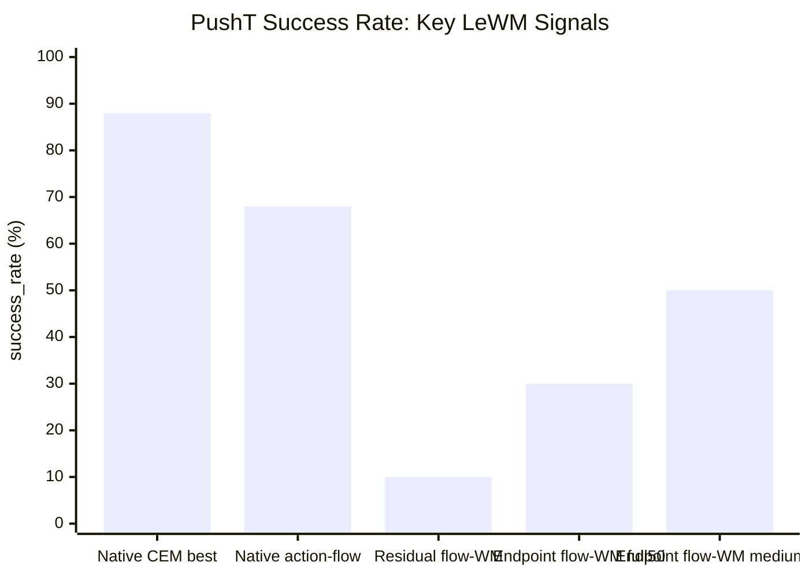
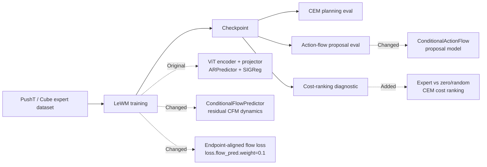

# LeWM Flow Progress Report

Generated: 2026-06-10 EDT

Sources:

- `docs/flow_2x2_plan.md`
- `docs/flow_2x2_status.md`
- `docs/flow_wm_residual_cfm_plan.md`
- `docs/flow_wm_followups_20260609.md`
- Local experiment outputs under `/storage/project/r-agarg35-0/eliu354/external_data/lewm_stablewm/experiments/`
- W&B project: https://wandb.ai/danny010324/lewm-flow-2x2

Scope: this report summarizes the LeWM/codebase experiments we have run so far. It does not use the Newt reference numbers except as external formatting inspiration.

## Conclusion & Insights

**Main signal:** the original LeWM world model with CEM planning is strong on PushT; our current flow-based world-model replacements are not yet competitive.

1. **Native LeWM + CEM is the current anchor.**  
   Good PushT checkpoints reach `80-88%` success on full 50-episode evals. The best observed full50 rows are seed 0 epoch 48 at `88%` and seed 2 epoch 75 at `88%`.

2. **Checkpoint selection matters.**  
   Later training is not automatically better. Seed 0 epoch 100 drops to `6%`, while seed 0 epoch 48 reaches `88%`. We need cost/eval-based checkpoint selection instead of assuming final epoch is best.

3. **Residual flow-WM is a negative result under the current CEM interface.**  
   The first residual flow world model gets only `0-10%` PushT success in 10-episode evals. Cost-ranking diagnostics explain why: for flow-WM seed 2, random actions beat expert actions about `43-50%` of the time.

4. **Endpoint-aligned flow-WM improves over pure residual flow, but is still below native LeWM.**  
   Endpoint flow reaches `30%` on one full50 eval and up to `50%` on 10-episode evals. This is progress, but still far from the native `80-88%` range.

## Key Results

| Experiment | Task | Seeds / eval | WM | Planner / policy | Best observed success | Takeaway |
| --- | --- | --- | --- | --- | ---: | --- |
| Native LeWM formal | PushT | full50 | Original ARPredictor | CEM | 88% | Strong baseline; current anchor. |
| Native LeWM final epoch | PushT | full50 | Original ARPredictor | CEM | 82-86% for seeds 1/2; seed 0 is 6% | Final epoch is unreliable. |
| Native WM + action-flow proposal | PushT | full50 | Original ARPredictor | action-flow proposal | 68% | Below native CEM; not the lead result. |
| Residual flow-WM | PushT | 10-episode evals | Conditional residual flow | CEM | 10% | Current flow-WM replacement fails under CEM. |
| Endpoint-aligned flow-WM | PushT | full50 / 10-episode evals | Flow + endpoint loss | CEM | 30% full50, 50% medium10 | Better than residual flow, still below native. |
| Cost-ranking diagnostic | PushT | 16 starts x 128 random chunks | Original vs flow variants | CEM cost | native rank 1.0; flow-WM rank 56-66 | Confirms planner-cost misalignment for flow-WM. |

## Pipeline (w/ Diff)

| Pipeline part | Original LeWM | Our current modification |
| --- | --- | --- |
| Data | PushT expert Lance dataset; Cube planned/downloaded | PushT became main formal scope; Cube/2x2 deferred after queue instability |
| World model | deterministic `ARPredictor` next-latent prediction | `ConditionalFlowPredictor` residual CFM, plus endpoint-aligned variant |
| Loss | prediction loss + SIGReg | flow-matching loss; endpoint follow-up adds endpoint prediction loss |
| Planner | CEM/MPC over learned latent cost | kept for formal WM comparison |
| Policy/proposal | original CEM sampling | optional `ConditionalActionFlow` proposal model |
| Logging | baseline eval output | added JSONL metrics, manifests, W&B naming, summaries |
| Cluster execution | direct Slurm jobs | added `embers` supervisors, resume chunks, project-storage runtime dirs |

## Ablations & Insights

### Native LeWM Checkpoints

| Row | Success | Read |
| --- | ---: | --- |
| seed 0 epoch 48, full50 | 88% | Best seed 0 checkpoint. |
| seed 1 epoch 83, full50 | 86% | Strong late checkpoint. |
| seed 2 epoch 75, full50 | 88% | Best seed 2 checkpoint. |
| seed 1 epoch 100, full50 | 82% | Final epoch works for seed 1. |
| seed 2 epoch 100, full50 | 86% | Final epoch works for seed 2. |
| seed 0 epoch 100, full50 | 6% | Final epoch can collapse badly. |

Insight: native LeWM is strong, but checkpoint selection is part of the system. Reporting only epoch 100 hides the actual model quality.

### Policy / Proposal Ablation

| WM | Planner / policy | Success | Read |
| --- | --- | ---: | --- |
| Original LeWM | CEM | 80-88% full50 | Best current pipeline. |
| Original LeWM | action-flow proposal | 58-68% for seeds 1/2; seed 0 6% | Does not beat CEM. |

Insight: action-flow proposal is not the main improvement path right now. The original CEM planner remains the correct baseline.

### Flow-WM Ablation

| WM variant | Eval result | Read |
| --- | ---: | --- |
| Residual flow-WM | 0-10% on 10-episode evals | Fails under current deterministic CEM rollout. |
| Endpoint-aligned flow-WM | 30% full50; up to 50% medium10 | Improves over residual flow, but still far from native LeWM. |

Insight: endpoint alignment is the first positive flow-WM signal, but it is not enough. The problem is likely planner-cost alignment, not just training loss.

### Cost-Ranking Diagnostic

| Checkpoint | mean expert rank | random better frac | Read |
| --- | ---: | ---: | --- |
| Native LeWM seed 2 epoch 75 | 1.0 | 0.0 | Expert actions are ranked best; CEM has a useful cost surface. |
| Endpoint flow seed 1 epoch 17 | 1.06 | 0.0005 | Cost ranking can look good for selected endpoint checkpoints. |
| Endpoint flow seed 0 epoch 19 | 4.31 | 0.025 | Better than residual flow but not as clean as native. |
| Residual flow seed 2 epoch 17 | 56.75 | 0.430 | Planner surface is nearly unusable. |
| Residual flow seed 2 epoch 24 | 65.56 | 0.501 | Random chunks beat expert chunks about half the time. |

Insight: this diagnostic explains the eval results. Native LeWM gives CEM a meaningful ranking; residual flow-WM often does not.

## Problems & Next Steps

1. **Use checkpoint selection, not final epoch, for native and flow models.**  
   Native seed 0 proves final epoch can be misleading. Keep cost-ranking + medium eval as the selector, then confirm with full50.

2. **Lead with native LeWM + CEM as the baseline and strongest result.**  
   Current flow variants should be framed as ablations/follow-ups, not improvements.

3. **Do not continue pure residual flow-WM as-is.**  
   Its cost ranking is too poor. More training alone is unlikely to fix planner alignment.

4. **If continuing flow-WM, focus on endpoint/planner alignment.**  
   Next experiments should compare endpoint loss weights, deterministic vs stochastic rollout, and cost-ranking-selected checkpoints.

5. **Defer Cube/full 2x2 until PushT flow-WM has a viable signal.**  
   Early PushT/Cube 2x2 infrastructure exists, but the queue was unstable and PushT already exposes the core issue.

## Appendix

Important output roots:

- Native LeWM: `/storage/project/r-agarg35-0/eliu354/external_data/lewm_stablewm/experiments/pusht_native_formal_20260605`
- Residual flow-WM: `/storage/project/r-agarg35-0/eliu354/external_data/lewm_stablewm/experiments/pusht_flow_wm_formal_20260608`
- Endpoint flow-WM: `/storage/project/r-agarg35-0/eliu354/external_data/lewm_stablewm/experiments/pusht_flow_endpoint_formal_20260609`
- Cost diagnostics: `/storage/project/r-agarg35-0/eliu354/external_data/lewm_stablewm/experiments/pusht_cost_diagnostics_20260609`
- Early PushT/Cube 2x2 infrastructure: `/storage/project/r-agarg35-0/eliu354/external_data/lewm_stablewm/experiments/flow_2x2_20260604`

Reporting caveats:

- 3-episode and 10-episode evals are diagnostics; full50 rows are more reliable.
- Native seed 0 epoch 100 is a real bad checkpoint, not representative of native LeWM's best capability.
- Runtime and cluster stability details are secondary for the report; the main scientific issue is whether the learned model gives CEM a useful cost surface.
