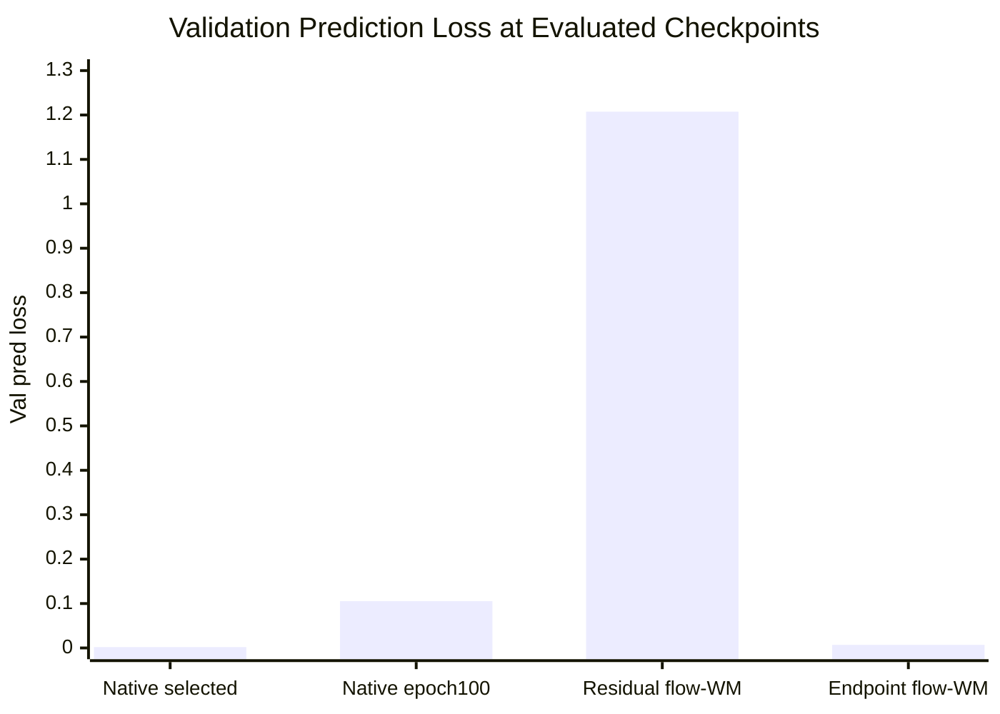
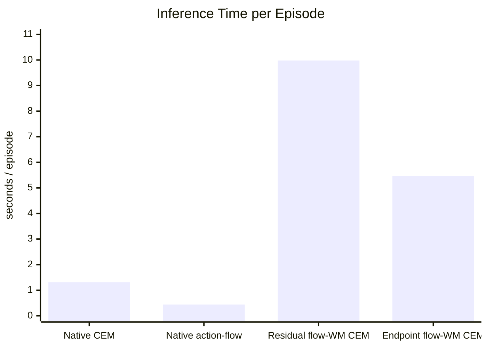
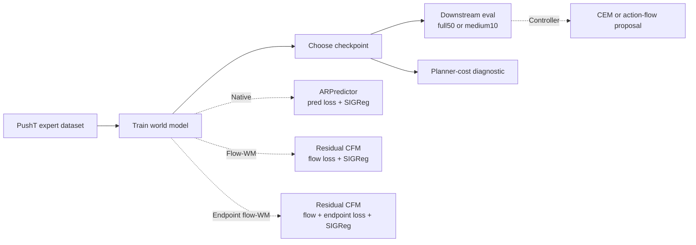

# LeWM Flow Progress Report

Generated: 2026-06-10 EDT

Sources:

- Local experiment outputs under `/storage/project/r-agarg35-0/eliu354/external_data/lewm_stablewm/experiments/`
- Planning docs: `docs/flow_wm_residual_cfm_plan.md`, `docs/flow_wm_followups_20260609.md`
- W&B project: `lewm-flow-2x2`

Scope: this report summarizes the LeWM experiments in this codebase. Debug runs, quick3 evals, queue repairs, and Slurm troubleshooting notes are intentionally excluded from the main results.

## Method Glossary

| Name | One-line definition |
| --- | --- |
| Native LeWM | Original LeWM from the paper: ViT encoder + deterministic ARPredictor trained with next-latent prediction loss and SIGReg. |
| CEM planner | The default LeWM online controller: sample action sequences, score them with the learned world model, and execute the first action. |
| Action-flow proposal | A learned action-sequence sampler scored by the world model; it changes the proposal policy, not the world model. |
| Residual flow-WM | Replaces the deterministic ARPredictor with a conditional flow model over latent residual dynamics. |
| Endpoint flow-WM | Residual flow-WM plus an endpoint prediction loss so the deterministic rollout lands near the next latent. |
| Cost-ranking diagnostic | Offline check that compares CEM cost for expert action chunks against zero/random chunks. |

## Protocols Used in Tables

| Protocol | Episodes / samples | Planner | Role in report |
| --- | ---: | --- | --- |
| full50 | 50 eval episodes | CEM unless stated | Main downstream PushT metric. |
| medium10 | 10 eval episodes | CEM | Checkpoint-screening metric. |
| cost ranking | 16 starts x 128 random chunks | CEM cost | Non-downstream metric for planner-cost quality. |

All success rates are reported as `Success rate (%)`. Mean and std are over the seed columns shown in the same row.

## Conclusion & Insights

**Main result:** native LeWM + CEM is still the strongest PushT pipeline. Flow-WM variants reveal useful failure modes, but they are not improvements yet.

1. **Native LeWM works when checkpoints are selected by validation/eval signals.**  
   Native LeWM + CEM reaches `87.3 +/- 1.2%` on full50 across seeds.

2. **Final epoch is not a safe checkpoint rule.**  
   At epoch 100, native seed 0 collapses to `6%` full50 while seeds 1/2 remain `82-86%`. The matching validation prediction loss also degrades badly for seed 0.

3. **Action-flow proposal is faster at inference but weaker in success.**  
   On epoch-100 native WMs, action-flow is `44.0 +/- 33.3%` full50 versus native CEM `58.0 +/- 45.1%`; it is faster per episode but not reliable.

4. **Residual flow-WM fails despite low flow loss.**  
   Residual flow-WM gets `0.0 +/- 0.0%` on medium10. Its validation flow loss is low, but its endpoint/prediction loss and cost ranking are poor.

5. **Endpoint flow-WM is the first positive flow-WM direction, but still below native LeWM.**  
   Endpoint flow-WM improves medium10 to `30.0 +/- 17.3%`; seed 0 full50 is `30%` versus native seed 0 full50 `88%`.

## Key Results

### Full50: Native WM, CEM vs Action-Flow

Same task and eval protocol: PushT full50. The rows below all use the original native LeWM world model.

| World model | Controller | Epoch s0 | Epoch s1 | Epoch s2 | Success s0 (%) | Success s1 (%) | Success s2 (%) | Mean +/- std (%) |
| --- | --- | ---: | ---: | ---: | ---: | ---: | ---: | ---: |
| Native LeWM | CEM | 48 | 83 | 75 | 88 | 86 | 88 | 87.3 +/- 1.2 |
| Native LeWM | CEM | 100 | 100 | 100 | 6 | 82 | 86 | 58.0 +/- 45.1 |
| Native LeWM | Action-flow proposal | 100 | 100 | 100 | 6 | 68 | 58 | 44.0 +/- 33.3 |

Read: the first row is the fair native baseline for capability. The second row is a checkpoint-selection ablation. The third row tests whether the learned action-flow proposal can replace CEM on the same epoch-100 native WMs.

### Full50: Seed-0 Endpoint Flow Check

Only seed 0 full50 is available for endpoint flow-WM, so this is a single-seed comparison rather than a 3-seed aggregate.

| World model | Controller | Seed | Epoch | Success rate (%) | Eval time / episode (s) |
| --- | --- | ---: | ---: | ---: | ---: |
| Native LeWM | CEM | 0 | 48 | 88 | 1.35 |
| Endpoint flow-WM | CEM | 0 | 14 | 30 | 5.56 |

Read: endpoint alignment improves over residual flow-WM, but seed 0 is still far below native LeWM and is slower at inference.

### Medium10: World-Model Variants Under CEM

Same task, controller, and eval protocol: PushT medium10 with CEM. This table is for checkpoint screening, not final reporting.

| World model | Epoch s0 | Epoch s1 | Epoch s2 | Success s0 (%) | Success s1 (%) | Success s2 (%) | Mean +/- std (%) |
| --- | ---: | ---: | ---: | ---: | ---: | ---: | ---: |
| Native LeWM | 35 | 28 | 33 | 100 | 90 | 80 | 90.0 +/- 10.0 |
| Residual flow-WM | 16 | 13 | 17 | 0 | 0 | 0 | 0.0 +/- 0.0 |
| Endpoint flow-WM | 14 | 12 | 12 | 50 | 20 | 20 | 30.0 +/- 17.3 |

Read: endpoint flow-WM is directionally better than residual flow-WM, but the gap to native LeWM is still large under the same medium10+CEM protocol.

## Training Metrics

Metrics are validation metrics at the evaluated checkpoints. Lower is better for loss columns.

| World model / checkpoint set | Seeds | Eval protocol | Success rate (%) | Val total loss | Val pred loss | Val flow loss | Val endpoint loss | Val SIGReg loss |
| --- | ---: | --- | ---: | ---: | ---: | ---: | ---: | ---: |
| Native LeWM selected | 3 | full50 | 87.3 +/- 1.2 | 0.1209 +/- 0.0018 | 0.0019 +/- 0.0004 | n/a | n/a | 1.322 +/- 0.024 |
| Native LeWM epoch 100 | 3 | full50 | 58.0 +/- 45.1 | 0.2575 +/- 0.2363 | 0.1053 +/- 0.1797 | n/a | n/a | 1.691 +/- 0.628 |
| Residual flow-WM | 3 | medium10 | 0.0 +/- 0.0 | 0.2646 +/- 0.0079 | 1.2075 +/- 0.0099 | 0.0612 +/- 0.0057 | n/a | 2.260 +/- 0.035 |
| Endpoint flow-WM | 3 | medium10 | 30.0 +/- 17.3 | 0.2507 +/- 0.0137 | 0.0069 +/- 0.0002 | 0.0578 +/- 0.0077 | 0.0069 +/- 0.0002 | 2.135 +/- 0.066 |

Training-metric read:

- Native seed 0 epoch 100 has poor validation prediction loss, matching its downstream collapse.
- Residual flow-WM lowers flow loss but keeps very high prediction/endpoint error, so flow loss alone does not predict CEM success.
- Endpoint flow-WM fixes endpoint prediction loss, but downstream success remains limited; this points to planner-cost alignment, not just one-step endpoint accuracy.

## Compute Metrics

Training wall time is estimated from local JSONL `wall_time`; eval time is from `evaluation_time` in eval metrics. These are practical run-time measurements, not profiler-grade kernel timings.

| Model / controller | Training progress used | Train wall time (h) | Eval protocol | Eval time / episode (s) |
| --- | --- | ---: | --- | ---: |
| Native LeWM + CEM | 100 epochs | 86.7 +/- 5.6 | selected full50 | 1.31 +/- 0.06 |
| Native LeWM + action-flow | native WM + action-flow policy | n/a | full50 | 0.44 +/- 0.08 |
| Residual flow-WM + CEM | 54-61 epochs | 63.8 +/- 1.3 | medium10 | 9.98 +/- 0.07 |
| Endpoint flow-WM + CEM | 28-30 epochs | 39.9 +/- 0.8 | medium10 | 5.47 +/- 0.54 |

Compute read: action-flow is faster at inference but has weaker success. Flow-WM variants are much slower under CEM because each latent rollout requires flow integration; endpoint flow is faster than residual flow in the measured evals but still slower than native LeWM.

## Planner-Cost Metrics

Cost ranking is not a downstream success metric. It asks whether the world model gives CEM a useful cost surface: expert action chunks should have lower cost than zero/random chunks.

| World model | Seed | Epoch | Mean expert rank | Random better frac | Mean expert cost | Mean random cost |
| --- | ---: | ---: | ---: | ---: | ---: | ---: |
| Native LeWM | 2 | 75 | 1.00 | 0.000 | 2.44 | 179.33 |
| Endpoint flow-WM | 1 | 17 | 1.06 | 0.0005 | 4.13 | 29.78 |
| Endpoint flow-WM | 0 | 19 | 4.31 | 0.025 | 4.88 | 30.83 |
| Endpoint flow-WM | 2 | 17 | 11.94 | 0.084 | 14.50 | 41.48 |
| Residual flow-WM | 2 | 17 | 56.75 | 0.430 | 176.00 | 176.22 |
| Residual flow-WM | 2 | 24 | 65.56 | 0.501 | 174.68 | 174.60 |

Planner-cost read: residual flow-WM often cannot rank expert action chunks better than random chunks. Endpoint flow-WM partially repairs the ranking, especially seed 1, but that does not yet translate into native-level downstream success.

## Pipeline (w/ Diff)

## Recommended Next Steps

1. **Finish endpoint flow-WM full50 for seeds 1 and 2.**  
   Do not compare endpoint seed 0 against native 3-seed mean as a final claim.

2. **Select checkpoints using multiple signals.**  
   Use validation pred/endpoint loss, medium10 success, and cost ranking before running full50.

3. **Stop treating residual flow loss as sufficient.**  
   Residual flow-WM has low flow loss but fails both downstream eval and cost ranking.

4. **Focus flow-WM changes on planner alignment.**  
   Next ablations should test endpoint-loss weight, deterministic vs stochastic flow rollout, and multi-sample CEM rollout.

5. **Export final W&B plots for the presentation.**  
   Recommended panels: validation pred loss, validation flow loss, validation endpoint loss, full50/medium10 success rate, evaluation time per episode, and cost-ranking metrics.

## Appendix

Important output roots:

- Native LeWM: `/storage/project/r-agarg35-0/eliu354/external_data/lewm_stablewm/experiments/pusht_native_formal_20260605`
- Residual flow-WM: `/storage/project/r-agarg35-0/eliu354/external_data/lewm_stablewm/experiments/pusht_flow_wm_formal_20260608`
- Endpoint flow-WM: `/storage/project/r-agarg35-0/eliu354/external_data/lewm_stablewm/experiments/pusht_flow_endpoint_formal_20260609`
- Cost diagnostics: `/storage/project/r-agarg35-0/eliu354/external_data/lewm_stablewm/experiments/pusht_cost_diagnostics_20260609`

Caveats:

- Mean/std is over the displayed seeds.
- Endpoint flow-WM full50 currently has only seed 0 in this report.
- Training wall time is affected by resume/preemption history; use it as practical compute cost, not exact hardware efficiency.
