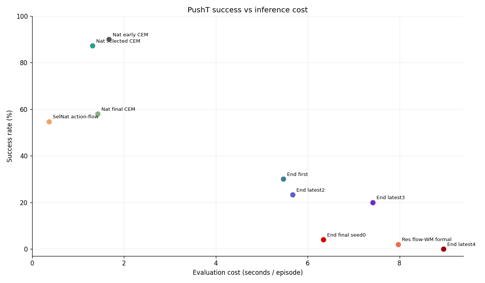
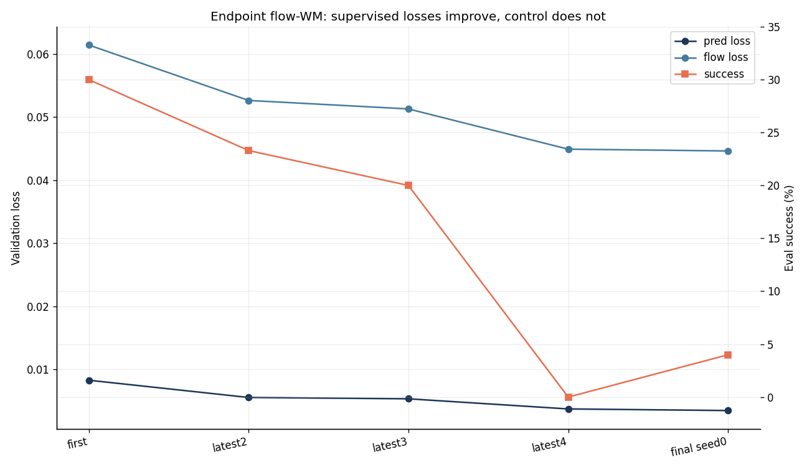
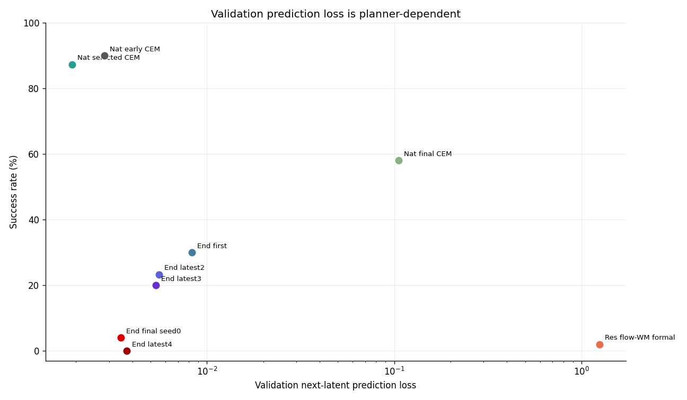
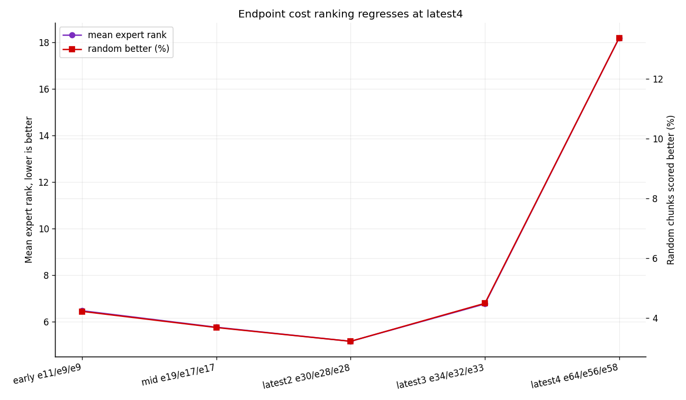

# LeWM Flow-WM Progress Report

Generated: 2026-06-15 EDT

Sources:

- Local outputs: `/storage/project/r-agarg35-0/eliu354/external_data/lewm_stablewm/experiments/`
- W&B project: `lewm-flow-2x2`
- Key summary table: `docs/assets/lewm_flow_progress_20260611/lewm_story_key_results.csv`
- Cost-rank summary table: `docs/assets/lewm_flow_progress_20260611/lewm_cost_rank_summary.csv`

## Conclusion & Insights

We are testing whether flow can improve LeWM by replacing the learned world-model dynamics while keeping the original PushT data, training loop, checkpointing, CEM planner, and real-environment eval pipeline fixed.

**Current answer: direct flow-WM replacement is not promising under the original LeWM/CEM interface.**

- Native LeWM + CEM remains the anchor: `87.3 +/- 1.2%` full50 success at `1.31s/episode`.
- Residual flow-WM is now formally closed: epoch-100 full50 is only `2.0%` mean success, with `validate/pred_loss_epoch ~= 1.25` and `7.97s/episode`.
- Endpoint flow-WM keeps improving one-step prediction (`0.0083 -> 0.0053 -> 0.0037`), but latest4 control collapses to `0%` medium10 while planner cost ranking gets worse (`mean expert rank 6.77 -> 18.19`). The first epoch-100 final checkpoint, seed 0, also only reaches `4%` full50.
- Selected-native action-flow is fast (`0.37s/episode`) and fairer than the old epoch-100-confounded action-flow run, but still reaches only `54.7%` full50, far below native CEM.

**Main insight:** the bottleneck is likely not model capacity or insufficient training time. The signal points to an interface mismatch: flow objectives can improve distributional or endpoint prediction, but CEM needs a deterministic, multi-step, action-conditional cost surface that ranks candidate action sequences correctly under closed-loop rollouts.

**Research decision from current evidence:** do not keep scaling the same endpoint-flow WM as the main path. The next useful experiments should change the training signal or planner interface: planner-aware cost ranking/margin losses, multi-step rollout consistency on CEM-like action chunks, or uncertainty-aware CEM if we actually use flow samples during planning. Action-flow is worth keeping only as a fast proposal baseline, not as the current best controller.

## Key Results

`Pred loss` is validation next-latent MSE. Training wall-time is not used as a main claim for long flow runs because `embers` preemption/resume makes it a queue-dependent number.

Fair comparison boundary: all claims below are PushT-only and use the same LeWM data/eval pipeline. Full50 is the main metric. Medium10 is a faster screening metric; it is still informative here because the flow-WM gap is large, consistent across seeds, and supported by validation/cost diagnostics.

| Setting | Eval | Epochs s0/s1/s2 | Pred loss | Success (%) | Sec/episode | Signal |
| --- | --- | --- | ---: | ---: | ---: | --- |
| Native LeWM + CEM, selected | full50 | 48 / 83 / 75 | `0.0019` | `87.3 +/- 1.2` | `1.31` | Fair baseline anchor. |
| Native LeWM + CEM, final | full50 | 100 / 100 / 100 | `0.1053` | `58.0 +/- 45.1` | `1.43` | Final epoch is not a safe checkpoint rule. |
| Selected native WM + action-flow | full50 | 48 / 83 / 75 | same WM | `54.7` | `0.37` | Fast proposal, but much weaker than CEM. |
| Residual flow-WM + CEM, formal | full50 | 100 / 100 / 100 | `1.2507` | `2.0` | `7.97` | Formal run confirms failure. |
| Endpoint flow-WM + CEM, first | medium10 | 14 / 12 / 12 | `0.0083` | `30.0 +/- 17.3` | `5.47` | Partial one-step repair. |
| Endpoint flow-WM + CEM, latest3 | medium10 | 34 / 32 / 33 | `0.0053` | `20.0 +/- 10.0` | `7.42` | Lower MSE, no control gain. |
| Endpoint flow-WM + CEM, latest4 | medium10 | 64 / 56 / 58 | `0.0037` | `0.0 +/- 0.0` | `8.96` | Best MSE, worst control. |
| Endpoint flow-WM + CEM, final seed 0 | full50 | 100 / - / - | `0.0035` | `4.0` | `6.34` | Partial final; still no recovery. |

-> The useful result is causal direction, not just ranking: native LeWM succeeds when validation prediction and planner cost ranking agree; flow-WM can improve its own losses without producing a robust CEM cost surface.

Current live status as of 2026-06-15 12:15 EDT:

- Endpoint-flow seed 0 reached epoch 100; full50 eval job `9970926` completed at `4.0%`.
- Endpoint-flow seeds 1 and 2 are running on H100 at epoch 98; supervisors `9971577` and `9974112` will resume or submit final CEM evals after the current chunks finish.
- Submitted final seed 0 cost-rank diagnostic job `9986072` on A100 to check whether epoch100 planner ranking matches the poor full50 result.

## Pipeline (w/ Diff)

Algorithm: LeWM PushT Training and Evaluation Pipeline (`->` marks our modification)

Input:
    PushT expert dataset: `pusht_expert_train.lance`.
    Each sample uses RGB pixels, action, proprio, and state.
    Training setup: history size 3, prediction target 1 next latent,
    frameskip/action block 5, train split 90%.
        -> This report is PushT-only; OGBench/Cube is not used for the claims.

Model:
    Original LeWM:
        pixels -> ViT-tiny encoder -> projector -> latent z
        action chunk -> action Embedder
        ARPredictor(z history, action embedding) -> next latent z
        objective: next-latent prediction loss + SIGReg

    Our WM changes:
        ARPredictor -> residual flow-WM
            objective: flow-matching loss + SIGReg
        ARPredictor -> endpoint flow-WM
            objective: flow loss + endpoint/prediction loss + SIGReg

    Our policy/proposal change:
        CEM proposal sampler -> conditional action-flow proposal
        WM kept fixed in this ablation.

Training:
    Keep fixed across fair comparisons:
        data, encoder/projector, action Embedder, optimizer,
        dataloader, checkpointing, W&B logging, and eval code.

    Change only:
        native dynamics head vs flow dynamics head,
        or CEM proposal vs action-flow proposal.

Evaluation:
    Main eval is closed-loop PushT real-env evaluation.
    At each step:
        observe -> encode latent -> plan with learned WM -> execute first action block -> replan.

    CEM settings:
        300 samples, 30 optimization steps, top-30 elites,
        horizon 5, receding horizon 5.

    Protocols:
        full50 = 50 episodes, main metric.
        medium10 = 10 episodes, checkpoint-screening metric.
        cost-rank diagnostic = expert action chunks should score below random chunks.

## Ablations & Insights

### 1. World-Model Architecture Ablation

| WM | Objective | Eval | Pred loss | Success (%) | Sec/episode | Interpretation |
| --- | --- | --- | ---: | ---: | ---: | --- |
| Native ARPredictor | pred + SIGReg | full50 | `0.0019` | `87.3` | `1.31` | Strong and cheap. |
| Residual flow-WM | flow + SIGReg | full50 | `1.2507` | `2.0` | `7.97` | Formal run confirms failure. |
| Endpoint flow-WM | flow + endpoint + SIGReg | medium10 | `0.0053` | `20.0` | `7.42` | One-step repair, closed-loop plateau. |
| Endpoint flow-WM latest4 | flow + endpoint + SIGReg | medium10 | `0.0037` | `0.0` | `8.96` | Lower MSE, worse planner ranking and control. |
| Endpoint flow-WM final seed 0 | flow + endpoint + SIGReg | full50 | `0.0035` | `4.0` | `6.34` | Epoch100 still fails. |

-> This isolates the failure to the WM/planner interface. Residual flow fails before control because CEM needs a point rollout. Endpoint flow makes that point rollout numerically reasonable, but the planner still does not get a reliable action-sequence cost landscape.

### 2. Endpoint-Flow Training Ablation

| Endpoint eval set | Epochs s0/s1/s2 | Pred loss | Flow loss | Success (%) | Cost-rank read |
| --- | --- | ---: | ---: | ---: | --- |
| First medium10 | 14 / 12 / 12 | `0.0083` | `0.0614` | `30.0` | early rank `6.48` |
| Latest2 medium10 | 30 / 28 / 28 | `0.0055` | `0.0526` | `23.3` | rank `5.17` |
| Latest3 medium10 | 34 / 32 / 33 | `0.0053` | `0.0513` | `20.0` | rank `6.77` |
| Latest4 medium10 | 64 / 56 / 58 | `0.0037` | `0.0449` | `0.0` | rank `18.19` |
| Final seed0 full50 | 100 / - / - | `0.0035` | `0.0446` | `4.0` | pending job `9986072` |

-> This is the strongest "do not just train longer" signal. The model becomes better at the supervised endpoint target while planner cost ranking gets worse, so the missing target is not more endpoint MSE; it is planner-relevant multi-step cost calibration.

### 3. Prediction Loss vs Control

| Comparison | Metric signal | Control signal | Research implication |
| --- | --- | --- | --- |
| Native selected vs final seed 0 | pred loss `0.00239 -> 0.31281` | full50 `88% -> 6%` | validation pred loss is meaningful for native checkpoint selection. |
| Residual flow-WM formal | flow loss `0.0394`, pred loss `1.2507` | full50 `2%` | flow loss alone is misleading. |
| Endpoint flow-WM | pred loss `0.0083 -> 0.0035` | medium10 `30% -> 0%`; final seed0 full50 `4%` | one-step endpoint MSE is not enough. |
| Endpoint latest3 -> latest4 | cost rank `6.77 -> 18.19` | medium10 `20% -> 0%` | planner ranking regresses while MSE improves. |

-> Prediction loss is useful only when it matches the planner interface. For native LeWM it does; for flow-WM it becomes a weak proxy. The next metric should measure whether the WM ranks CEM candidate rollouts the same way the real environment would, not only whether the next latent is close.

### 4. Cost-Ranking Diagnostic

Lower expert rank is better. Rank `1` means expert action chunks are scored best among random alternatives.

| Model / checkpoint | Mean expert rank | Random-better frac | Real-env read |
| --- | ---: | ---: | --- |
| Native seed 2 e75 | `1.00` | `0.0000` | full50 `88%` |
| Residual flow seed 2 e17 | `56.75` | `0.4302` | medium10 `0%` |
| Residual flow seed 2 e24 | `65.56` | `0.5015` | near-random cost surface |
| Endpoint early mean, e11/e9/e9 | `6.48` | `0.0422` | early quick eval `2/9` |
| Endpoint mid mean, e19/e17/e17 | `5.77` | `0.0368` | medium10 `20.0%` |
| Endpoint latest2 mean | `5.17` | `0.0322` | medium10 `23.3%` |
| Endpoint latest3 mean | `6.77` | `0.0449` | medium10 `20.0%` |
| Endpoint latest4 mean | `18.19` | `0.1336` | medium10 `0.0%` |
| Endpoint final seed0 e100 | pending | pending | full50 seed0 `4.0%` |

-> Cost ranking separates native/residual cleanly and now gives a strong negative endpoint signal: latest4 has the best endpoint MSE but the worst endpoint cost rank. Expert-vs-random ranking is still an imperfect diagnostic, but this regression is enough to stop treating endpoint MSE as a useful standalone objective.

### 5. Compute / Runtime Ablation

| Setting | Train h | Sec/episode | Success (%) | Compute read |
| --- | ---: | ---: | ---: | --- |
| Native selected CEM | `61.3` | `1.31` | `87.3` | best Pareto point |
| Selected native action-flow | n/a | `0.37` | `54.7` | fast, but much weaker than CEM |
| Native action-flow epoch100 | n/a | `0.44` | `44.0` | fast, but checkpoint-confounded |
| Residual flow-WM formal | n/a | `7.97` | `2.0` | dominated |
| Endpoint flow-WM latest3 | `46.3` | `7.42` | `20.0` | dominated |
| Endpoint flow-WM latest4 | n/a | `8.96` | `0.0` | worse with more training |
| Endpoint flow-WM final seed0 | n/a | `6.34` | `4.0` | no final recovery |

-> Runtime is a research constraint, not just engineering overhead. Since CEM calls the WM many times per control step, a flow-WM must either deliver a large success gain or expose useful uncertainty to the planner. The current version does neither, so it is Pareto-dominated.

## Problems & Next Steps

Where the project is currently stuck:

1. **The planner consumes a deterministic cost surface, but flow-WM is trained as a distributional transition model.**
   This is why residual flow can lower flow loss while giving CEM a bad rollout.

2. **Endpoint loss solves the visible prediction bug but not the decision problem.**
   Endpoint-flow reaches lower next-latent MSE, yet success plateaus and latest4 cost ranking regresses. The missing supervision is probably on action-sequence ranking and multi-step compounding error, not single-step endpoint accuracy.

3. **The diagnostic is not hard enough yet.**
   Expert-vs-random cost ranking catches residual-flow failure, and latest4 now also catches endpoint degradation. Earlier endpoint checkpoints could still look acceptable on this simple test while failing in real env, so we need CEM-candidate ranking, near-miss negatives, or rollout-level calibration.

4. **Flow-WM currently loses on compute.**
   It is slower and less successful, so the only reason to keep it is if we change the planner/objective enough for flow's distributional structure to matter.

5. **Action-flow is useful as a fast proposal baseline, but not as the main controller.**
   On selected native WMs it improves over the unfair epoch-100 action-flow comparison, but `54.7%` full50 is still far below native CEM.

Next experiments that are actually informative:

| Direction | Why it follows from the evidence | Success criterion |
| --- | --- | --- |
| Planner-aware WM loss | Endpoint MSE improved without control gain. | Expert/CEM-good chunks receive lower predicted cost than near-miss CEM candidates. |
| Multi-step latent rollout loss | CEM evaluates action sequences, not isolated next latents. | Cost rank and real-env success improve together over 5-step chunks. |
| Uncertainty-aware flow planning | Flow is only useful if sampled uncertainty changes CEM's decision. | Multi-sample or risk-sensitive CEM improves success enough to justify runtime. |
| Action-flow as a proposal baseline | Selected-native action-flow is fast but only `54.7%`. | Improve proposal quality without sacrificing too much native CEM success. |
| Stop unchanged endpoint-flow scaling | Latest4 has lower MSE but worse cost rank. | Only continue if a new objective/planner change is added. |

Advisor-level decision point: should we make flow compatible with the original deterministic CEM planner, or change the planner to consume flow uncertainty? Current evidence favors the first as the next controlled experiment, because it preserves the original LeWM pipeline and tests the smallest hypothesis change.

## Appendix

Output roots:

- Native LeWM: `/storage/project/r-agarg35-0/eliu354/external_data/lewm_stablewm/experiments/pusht_native_formal_20260605`
- Residual flow-WM: `/storage/project/r-agarg35-0/eliu354/external_data/lewm_stablewm/experiments/pusht_flow_wm_formal_20260608`
- Endpoint flow-WM: `/storage/project/r-agarg35-0/eliu354/external_data/lewm_stablewm/experiments/pusht_flow_endpoint_formal_20260609`
- Cost diagnostics: `/storage/project/r-agarg35-0/eliu354/external_data/lewm_stablewm/experiments/pusht_cost_diagnostics_20260609`
- Selected native action-flow: `/storage/project/r-agarg35-0/eliu354/external_data/lewm_stablewm/experiments/pusht_native_selected_action_flow_20260611`

Caveat:

- Latest3 cost-rank jobs wrote local metrics under the default diagnostic variant path (`wm_flow_endpoint_policy_original/seed_x/eval`) because the diagnostic sbatch did not pass `experiment.variant`; W&B summaries and Slurm logs match the values reported above.
- This was fixed before latest4 cost-rank diagnostics, which now write to explicit latest4 variant paths.
- Latest4 endpoint medium10 evals were resubmitted with the correct `EVAL_BUDGET=50`; all three seeds completed at `0.0%` success.
- On 2026-06-15, endpoint seed 0 reached epoch 100 and its full50 eval completed at `4.0%`; seeds 1/2 are still running at epoch 98, so the formal epoch100 mean is not complete yet.
- Final seed 0 cost-rank diagnostic job `9986072` is queued on A100/embers under variant `cost_rank_flow_endpoint_final_e100_s0_a100`.
